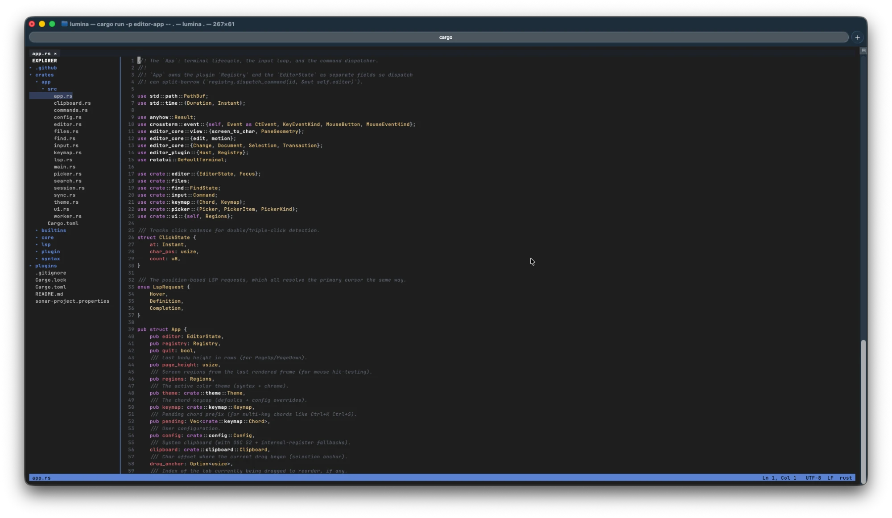
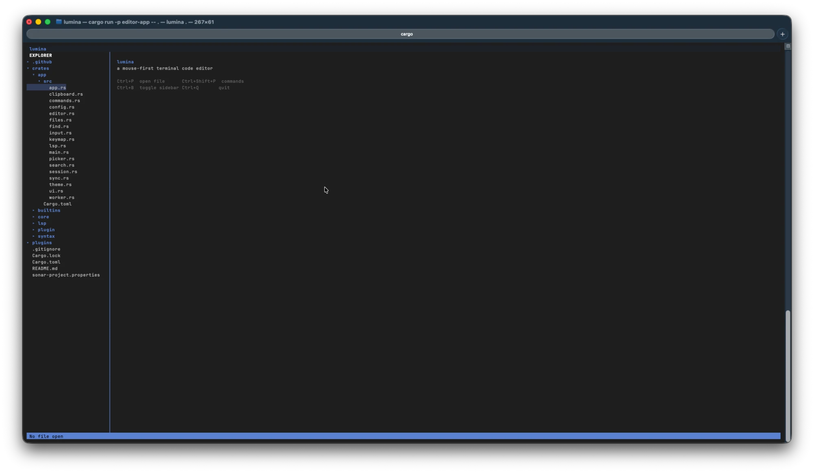

# lumina

A mouse-first, VS Code-like **terminal** code editor in Rust, built on its own plugin
system. Tabs, a clickable directory explorer, full mouse support, syntax highlighting,
find/replace, project search, live file-sync, multi-cursor, an LSP client, and a sandboxed
external plugin runtime.

## Screenshots





## Architecture

Six crates (headless core, thin view — the Helix/VS Code split):

| Crate | Role |
|---|---|
| `editor-core` | Headless model: rope, normalized multi-cursor selections, reversible transactions/undo, motions, and the pure `screen_to_char`/`char_to_screen` coordinate mapping. No terminal deps. |
| `editor-syntax` | tree-sitter parsing + highlight-query → capture spans (cached, viewport-only). |
| `editor-lsp` | LSP client: JSON-RPC transport, UTF-16 position conversion, diagnostics. |
| `editor-plugin` | The contribution API (traits + registries + event bus), the `Host` surface, and the external plugin runtime — the kernel that hosts plugins. |
| `editor-builtins` | The core features implemented **as plugins** (the explorer). |
| `editor-app` | The `lumina` binary: event loop, ratatui rendering, keymap, and wiring. |

Everything is a command; a document holds a *set* of selections; features are plugins;
render is a pure function of state; all buffer mutation goes through the transaction API.

## Build & run

```sh
cargo build --workspace
cargo test  --workspace
cargo clippy --workspace --all-targets -- -D warnings
cargo fmt --all
cargo run -p editor-app -- <path>     # or: cargo run --bin lumina -- <path>
```

## Keys (defaults, remappable in config)

`Ctrl+P` quick-open · `Ctrl+Shift+P` command palette · `Ctrl+F`/`Ctrl+H` find/replace ·
`Ctrl+Shift+F` project search · `Ctrl+B` toggle sidebar · `Ctrl+D` add cursor at next match ·
`Alt+Click` add cursor · `Ctrl+G` go to line · `Ctrl+S` save · `Ctrl+K Ctrl+S` save as ·
`Ctrl+N` new file · `F8`/`Shift+F8` next/prev diagnostic · `Ctrl+Space` completions ·
`F12` go to definition · `Shift+F12` find references · `Ctrl+Shift+O` document symbols ·
`Ctrl+Q` quit.

## Configuration

`~/.config/lumina/config.toml`:

```toml
[settings]
tab_width = 4
sidebar_width = 30
follow_mode = true          # auto-scroll to external edits as an agent writes files
poll_watch = false          # set true on devcontainer/NFS mounts where inotify is unreliable
auto_pairs = true           # auto-close brackets/quotes, type over closers, delete empty pairs
auto_indent = true          # copy indent on newline (brace-aware); dedent on a closing bracket
trim_trailing_whitespace = false  # on save, strip trailing spaces/tabs from every line
insert_final_newline = false      # on save, ensure the file ends with a single newline
icons = false               # Nerd Font file glyphs in the explorer (needs a patched font)

[keys]
"ctrl+k ctrl+u" = "shout.line"

[lsp]
rust = "rust-analyzer"      # diagnostics; inert unless configured

[theme]                     # override syntax colors by capture name
keyword = "#c678dd"
```

## Plugins

The editor is built on its own plugin system: built-ins register through the same API as
third-party plugins. External plugins live in `~/.config/lumina/plugins/` or
`<project>/.lumina/plugins/`, each a folder with a `plugin.toml` manifest and a guest module.
Two substrates run through the *same* contribution API:

- **Rhai script** (default) — a `main.rhai` returning a list of host actions.
- **WebAssembly** (`runtime = "wasm"`) — a sandboxed `.wasm`/`.wat` guest with **no host
  imports**, fuel-metered against runaway loops, run on the `wasmi` engine.

Both are **deny-by-default**: a plugin declares `capabilities` (`edit`, `ui`, `fs:read`) and
can only take the actions it was granted. See `plugins/` for worked examples — `shout`, `todo`,
`inspector` (Rhai) and `wasm-hello` (WebAssembly).
